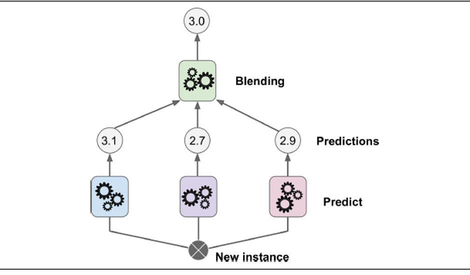

# Desharnais
## Stacking (Stacked Generalization)

Stacking is a type of ensemble technique which combines the predictions of two or more models, also called base models, and use the combination as the input for a new model (meta-model) i.e. a new model is trained on the predictions of the base models. 
 

Suppose you have a regression problem and you can use several models like Linear regression, SVM, KNN, Random forest etc. The idea is to use few models  as the base model and make predictions using these models. Now the predictions made by these models are used as an input feature for Linear Regression to train on and give prediction.

Stacking, just like other ensemble techniques, tries to improve the accuracy of a model by using predictions of not so good models and then using those predictions as an input feature for a better model.

Stacking can be multilevel e.g. using base models as level 1 then passing the predictions into another set of sub-base models at level 2 and so on. Then at the end using meta-model/models which take predictions of the last sub base models as input and does prediction.

Let's understand more by looking at the steps involved for stacking:

*	Split the dataset into a training set and a holdout set. 

   Generally, we do a 80-20 split of the training set and the hold out set. 
  

*	Split the training set again into training and test dataset e.g. x1_train, y1_train, x1_test, y1_test

*	Train all the base models on training set  x1_train, y1_train.

*	After training is done, get the predictions of all the base models on the validation set x2. 

*	Stack all these predictions together as it will be used as input feature for the meta_model.

*	Again, get the prediction for all the base models on the test set i.e. x1_test 

*	Again, stack all these predictions together  as it will be used as the prediction dataset for the meta_model.

*	Use the stacked data from step 5 as the input feature for meta_model and validation set y2 as the target variable and train the model on these data.

*	Once, the training is done check the accuracy of meta_model by using data from step 7 for prediction and y1_test for evaluation.
